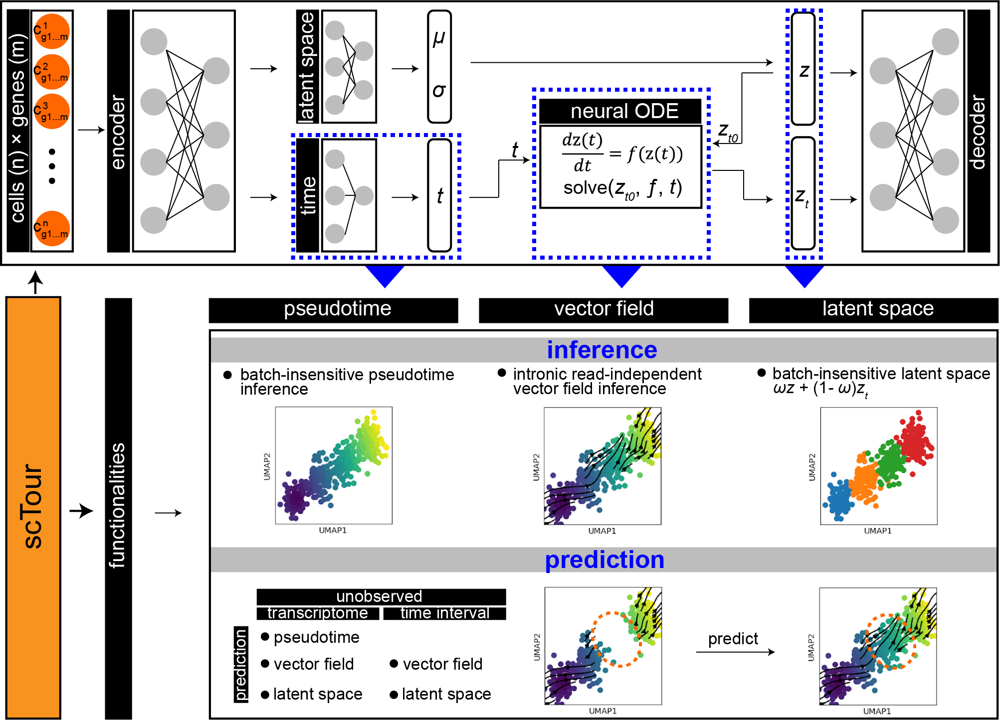

# About scTour

scTour is an innovative and comprehensive method for dissecting cellular dynamics by analysing datasets derived from single-cell genomics. It provides a unifying framework to depict the full picture of developmental processes from multiple angles including developmental pseudotime, vector field and latent space, and further generalises these functionalities to a multi-task architecture for within-dataset inference and cross-dataset prediction of cellular dynamics in a batch-insensitive manner.

<p align="center"></p>

# Preprint

Considering cite this [paper](https://NNN) if you use scTour in your analysis.

# scTour features

- unsupervised estimates of cell pseudotime along the trajectory with no need for specifying starting cells
- efficient inference of vector field with no dependence on the discrimination between spliced and unspliced mRNAs
- cell trajectory reconstruction using latent space that incorporates both intrinsic transcriptome and extrinsic time information
- model-based prediction of pseudotime, vector field, and latent space for query cells/datasets
- Reconstruction of transcriptomic space given an unobserved time interval

# scTour performance

- [x] insensitive to batch effects
- [x] robust to cell subsampling
- [x] scalable to large datasets

# Installation

```console
pip install sctour
```

# Documentation

Full documentation can be found [here](https://NNN).
